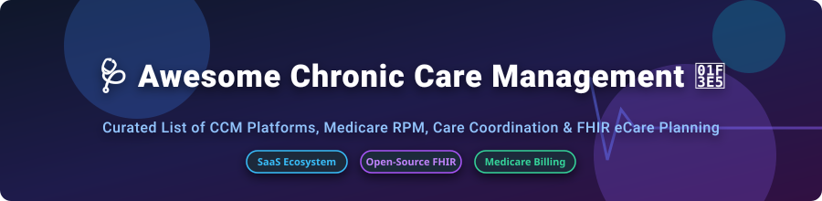

  

# 🩺 Awesome Chronic Care Management (CCM) 🏥

  
  
  
  

## 🚀 Overview & Ecosystem Guide

A curated directory of top **Chronic Care Management (CCM) SaaS platforms**, **Remote Patient Monitoring (RPM)** tools, **Medicare Care Coordination** software, and **Open-Source FHIR eCare Planning** repositories.

These systems empower health systems, ACOs, primary care groups, and specialty clinics to enroll eligible Medicare/Medicaid beneficiaries, design personalized care plans, log non-face-to-face monthly clinical outreach time, and maximize reimbursement under CPT codes (99490, 99487, 99439, 95250, etc.).

---

## 💡 Market Landscape & Industry Analysis

> 📊 **Estimated Market Size & Structure**: The U.S. Chronic Care Management & Remote Patient Monitoring market is estimated at **$18.5 Billion to $22.4 Billion (2026)**, expanding at a CAGR of **17.8%**. The market is **moderately fragmented**—dominated by established health IT giants (e.g. WellSky) alongside specialized full-service clinical outreach platforms (ChartSpan, TimeDoc) and SaaS workflow solutions (ThoroughCare, Prevounce).

---

## 💼 SaaS/Hosted CCM Platforms

| 🏢 Platform | 💰 Pricing Model & Starting Tier | 🎁 Free Tier / Trial Limit | 📊 Company Size & Financial Scale | 📝 Key Features & Focus |
| :--- | :--- | :--- | :--- | :--- |
| **[WellSky](https://wellsky.com/)** ⚡ | Custom quote; per-provider enterprise tier (starting ~$250/provider/mo) | 14-day enterprise demo / sandbox request | **$1B+ Revenue** (PE-backed by TPG / Leonard Green) | Enterprise health system care management, post-acute EHR, CCM, & care coordination. |
| **[CareHarmony](https://www.careharmony.com/)** 🩺 | Revenue-share model or ~$35–$45 per enrolled patient/month | 30-day risk-free practice ROI pilot | **$50M+ Revenue** (Series B PE-funded) | Full-service clinical outreach, AI care management, & turnkey Medicare CCM staffing. |
| **[ChartSpan](https://www.chartspan.com/)** 📈 | Managed service: $30–$40 per active enrolled patient/mo | 30-day practice assessment & workflow demo | **$37.2M Raised / $30M+ Rev** (Acquired Validic) | Largest turnkey CCM solution in the US; 24/7 clinician outreach & audit compliance. |
| **[TimeDoc Health](https://www.timedochealth.com/)** 🕒 | SaaS + Clinical staffing options (Starting ~$25/patient/mo) | 14-day interactive software sandbox demo | **$70.5M Funding Raised** (Aldrich Capital) | EHR-integrated virtual care management, CCM, RPM, and Behavioral Health Integration (BHI). |
| **[CoachCare](https://www.coachcare.com/)** 📱 | Modular SaaS tier starting at $199/clinic/month | 14-day free platform trial | **$50M Valuation / $20M Raised** | Integrated RPM hardware devices, custom mobile patient apps, and CCM workflows. |
| **[Optimize Health](https://www.optimize.health/)** 📊 | Software-only tier starting at $15/patient/month | 14-day free software trial | **$23.7M Funding Raised** (Frist Cressey) | Self-managed RPM & CCM platform with automated CPT billing code generation. |
| **[Signallamp Health](https://www.signallamphealth.com/)** (Tellihealth) 🏥 | Shared-reimbursement model (~40-50% of Medicare CPT payout) | 30-day clinical workflow pilot | **$20M+ Revenue** (Merged into Tellihealth) | Dedicated nurse-led care management embedded directly into provider EHRs. |
| **[ThoroughCare](https://www.thoroughcare.net/)** 🛠️ | Tiered SaaS starting at $250/practice/month | 14-day free trial (no credit card required) | **$12M+ Revenue** ($5M Series A) | Guided clinical workflows for CCM, RPM, TCM, AWV, and BHI with EHR integration. |
| **[Prevounce](https://www.prevounce.com/)** 🛡️ | Software tier starting at $5/active patient/month | 30-day free software sandbox trial | **$10M+ Valuation** (Venture-backed) | All-in-one compliance, annual wellness visits (AWV), RPM hardware, and CCM software. |
| **[Health Recovery Solutions](https://www.healthrecoverysolutions.com/)** (HRS) 📡 | Enterprise device + SaaS tier (custom quote starting ~$300/patient/mo) | 14-day interactive telehealth platform demo | **$100M+ Valuation** (LLR Partners backed) | Advanced remote patient monitoring, biometric telemetry kits, and post-acute CCM. |

---

## 🔓 Open-Source GitHub Projects

These open-source healthcare repositories provide foundational building blocks for HL7 FHIR care planning, SMART-on-FHIR apps, synthetic chronic patient data generation, and clinical decision support logic.

| 📦 Repository & Project Name | ⭐ Stars | 🛠️ Tech Stack & Domain | 🔗 Stargazers | 📜 Description & Use Case |
| :--- | :---: | :--- | :---: | :--- |
| **[Synthea Patient Generator](https://github.com/synthetichealth/synthea)** 🧪 |  | Java, FHIR, Synthetic Data | [Link](https://github.com/synthetichealth/synthea/stargazers) | Synthetic patient population generator producing realistic chronic disease histories and care plans. |
| **[Medplum Platform](https://github.com/medplum/medplum)** 🚀 |  | TypeScript, React, FHIR | [Link](https://github.com/medplum/medplum/stargazers) | Open-source headless EHR and developer platform for building custom FHIR chronic care workflows. |
| **[HAPI FHIR Server](https://github.com/hapifhir/hapi-fhir)** ⚡ |  | Java, HL7 FHIR Standard | [Link](https://github.com/hapifhir/hapi-fhir/stargazers) | Premier open-source Java implementation of the HL7 FHIR specification for care plan storage. |
| **[OpenMRS Core](https://github.com/openmrs/openmrs-core)** 🌍 |  | Java, React, MySQL | [Link](https://github.com/openmrs/openmrs-core/stargazers) | Global open-source enterprise EMR system adapted for chronic disease management in clinical settings. |
| **[OpenSRP FHIR Core](https://github.com/opensrp/fhircore)** 📱 |  | Kotlin, Android, FHIR | [Link](https://github.com/opensrp/fhircore/stargazers) | Offline-first mobile healthcare app built on WHO Smart Guidelines & FHIR for frontline chronic care providers. |
| **[MyCarePlanner](https://github.com/chronic-care/mycareplanner)** 📅 |  | TypeScript, SMART-on-FHIR | [Link](https://github.com/chronic-care/mycareplanner/stargazers) | Patient-facing SMART-on-FHIR eCare plan application for multiple chronic condition (MCC) tracking. |
| **[eCarePlanner Clinical App](https://github.com/chronic-care/eCarePlanner)** 🩺 |  | TypeScript, Angular, FHIR | [Link](https://github.com/chronic-care/eCarePlanner/stargazers) | Provider-facing electronic care planning dashboard supporting shared goals and interventions. |
| **[CDS Chronic Care Logic](https://github.com/chronic-care/cds-logic)** 🧠 |  | CQL, FHIR PlanDefinition | [Link](https://github.com/chronic-care/cds-logic/stargazers) | Clinical Decision Support (CDS) rules engine and Clinical Quality Language (CQL) for chronic care. |
| **[MCC Sample Data](https://github.com/chronic-care/mcc-sample-data)** 📁 |  | JSON, FHIR R4 Bundles | [Link](https://github.com/chronic-care/mcc-sample-data/stargazers) | Standardized synthetic FHIR resource datasets formatted for testing multi-chronic condition systems. |

---

## 🎯 Key Features of CCM Software & Workflows

- **📋 Automated Care Plan Generation**: Interactive, patient-centered care plan creation supporting CMS chronic disease criteria.
- **⏱️ Non-Face-to-Face Time Logging**: Audit-proof tracking of clinical staff phone calls, patient outreach, and coordination time (CPT 99490).
- **🔌 EHR Integration**: Seamless bi-directional HL7/FHIR integrations with Epic, Cerner, Athenahealth, eClinicalWorks, and Allscripts.
- **📡 Remote Patient Monitoring (RPM) Sync**: Biometric data ingestion from cellular BP cuffs, glucometers, and pulse oximeters.
- **💰 Billing & Coding Automation**: Billing engine outputting pre-validated claims for CPT 99490, 99487, 99439, 99453, 99454, and 99457.

---

## 🤝 How to Contribute

Contributions are welcome! Please follow these simple guidelines:

1. Fork this repository 🍴
2. Create your feature branch (`git checkout -b feature/AddCoolPlatform`) 🌿
3. Add SaaS or Open-Source CCM entries to `README.md` using standard markdown tables 📝
4. Open a Pull Request with a brief summary of the added platform 🚀

---

## 💖 Support & Community

If you find this repository helpful for your clinical workflow, health IT architecture, or research, please consider supporting us:

- ⭐ **Star this repository** to help others discover it!
- 🔀 **Fork & Share** with fellow health tech engineers and clinicians!
- ☕ **Buy Me a Coffee**: Support ongoing open-source healthcare list maintenance via [GitHub Sponsors](https://github.com/sponsors/ishandutta2007).

---

## 📈 Star History

---

## ⚠️ Disclaimer

This repository is a community-curated directory for informational and educational purposes only. Mention of commercial software does not constitute endorsement. Compliance with Medicare CCM rules (CMS CPT 99490 guidelines) and HIPAA security standards remains the responsibility of the healthcare provider.

---

**Made with ❤️ for care coordination teams, health informatics developers, and value-based care innovators.**
